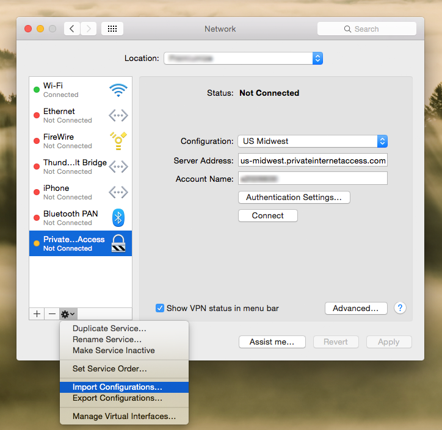
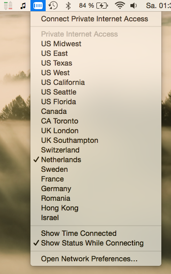
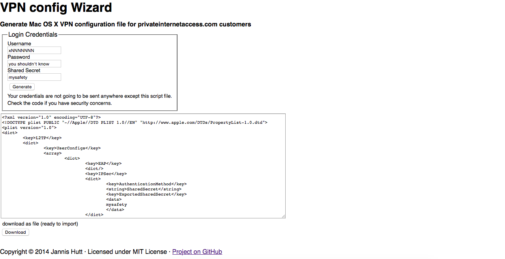

# privateinternetaccess.com Mac OS X VPN config generator
Many VPN Services come with an own client who knows how to connect to the different server locations. So does PrivateInternetAccess's VPN service, too. But that's just ugly.
Of course, you can choose to add 18+ various server locations to your System Preferences on your own, but, trust me, this is painful. So I created this little script to generate a VPN configuration file containing all server locations. 

It's easy as 1-2-3 and ready to import!

# Compatibility
It is - afaik - compatible with Mac OS 10.5+.
Already tested with 10.9 Mavericks and 10.10 Yosemite

(UI/UX is overrated in this case. Fork and make a pull request if you don't think so.)